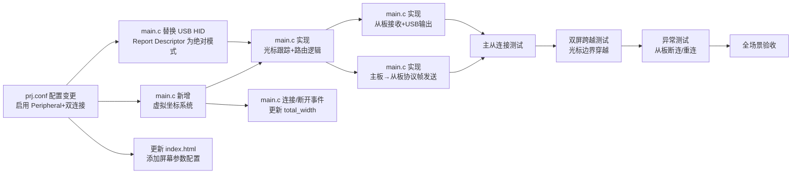

# 主从板多屏 KVM 方案（v4 - 双屏绝对定位 + 协议帧 + 单固件 + WebHID 配置）

> **核心设计**：两块板分别连接两台电脑，M720 鼠标在两个屏幕间无缝移动。主板跟踪绝对光标位置，根据光标所在屏幕路由鼠标事件。主从通信采用**带类型标签的协议帧**。所有代码在 `main.c`，WebHID 配置角色和屏幕参数。

---

## 一、架构总览

```
┌──────────────────────────────────────────────────────────────────────────┐
│                          物理连接拓扑                                    │
│                                                                          │
│                         虚拟屏幕：3840 x 1080                             │
│                    ┌─────────────────┬─────────────────┐                │
│                    │   屏幕1（主板侧）  │   屏幕2（从板侧）  │                │
│                    │  [0,0]..[1919,1079]│[1920,0]..[3839,1079]│                │
│                    └────────┬────────┴────────┬────────┘                │
│                             │                  │                          │
│  ┌──────────┐  BLE HID     │ USB HID          │ USB HID                  │
│  │ M720     │◄────────────►│ 主板             │ 从板                     │
│  │ 鼠标      │  (HOGP)     │ (Central+Peri)   │ (Central)                │
│  └──────────┘              │ ▲               │ ▲                        │
│                             │ │ BLE GATT       │ │                        │
│                             │ │ 协议帧           │ │                        │
│                             │ └───────────────┘ │                        │
│                             ▼                    ▼                         │
│                        ┌──────────┐         ┌──────────┐                │
│                        │ 电脑1     │         │ 电脑2     │                │
│                        │ 1920x1080 │         │ 1920x1080 │                │
│                        └──────────┘         └──────────┘                │
└──────────────────────────────────────────────────────────────────────────┘
```

### 角色分配

| 板子     | BLE 角色             | USB 角色                            | 连接电脑 | 职责                                                 |
| -------- | -------------------- | ----------------------------------- | -------- | ---------------------------------------------------- |
| **主板** | Central + Peripheral | USB HID 绝对鼠标 + CDC ACM + WebHID | 电脑 1   | 接收 M720 数据，跟踪虚拟光标位置，路由事件到对应屏幕 |
| **从板** | Central              | USB HID 绝对鼠标 + CDC ACM + WebHID | 电脑 2   | 接收主板协议帧，在本地屏幕输出绝对鼠标事件           |

---

## 二、虚拟坐标系统（核心设计）

### 坐标模型

```
主板维护虚拟光标 (cursor_x, cursor_y)
范围：[0, 0] ~ [total_width-1, total_height-1]

默认布局：水平排列
  total_width = screen1_width + screen2_width
  total_height = max(screen1_height, screen2_height)

屏幕区域判断：
  cursor_x < screen1_width  → 屏幕1（主板处理）
  cursor_x >= screen1_width → 屏幕2（转发从板处理）
```

### 坐标映射

| 虚拟坐标范围    | 对应屏幕 | 处理板   | USB 输出到 |
| --------------- | -------- | -------- | ---------- |
| X: [0, 1919]    | 屏幕 1   | 主板自身 | 电脑 1     |
| X: [1920, 3839] | 屏幕 2   | 转发从板 | 电脑 2     |

### WebHID 可配置参数

| 参数            | 默认值              | 说明                       |
| --------------- | ------------------- | -------------------------- |
| `screen_width`  | `1920`              | 单屏宽度（像素）           |
| `screen_height` | `1080`              | 单屏高度（像素）           |
| `screen_layout` | `0`                 | `0`=水平排列, `1`=垂直排列 |
| `role`          | `1`-slave           | `0`=master, `1`=slave      |
| `own_mac`       | `DE:AD:BE:EF:00:01` | 本机 BLE 地址              |
| `peer_mac`      | `DE:AD:BE:EF:00:02` | 目标板 BLE 地址            |

### 同步模式

- **未连接从板**：`total_width = screen_width`（单屏模式），光标锁定在屏幕 1
- **已连接从板**：`total_width = screen1_width + screen2_width`（双屏模式），光标可自由跨越

---

## 三、数据流（完整流程）

```
M720 鼠标发出相对移动 (dx, dy)
  │
  ▼
主板接收 M720 7字节报告
  │
  ├─ 解包：buttons, dx, dy, wheel, pan
  │
  ├─ 更新虚拟光标位置：
  │     cursor_x += dx   （带缩放因子，匹配虚拟分辨率）
  │     cursor_y += dy
  │     clamp(cursor_x, 0, total_width-1)
  │     clamp(cursor_y, 0, total_height-1)
  │
  ├─ 判断光标所在屏幕：
  │
  │  ┌─ cursor_x < screen1_width ──► 屏幕1（主板处理）
  │  │      ├─ USB HID 绝对鼠标报告发送给电脑1
  │  │      │    [buttons(1)][abs_x(2)][abs_y(2)][wheel(1)][pan(1)]
  │  │      └─ 按键/滚轮事件 → 主板 USB HID
  │  │
  │  └─ cursor_x >= screen1_width ──► 屏幕2（转发从板）
  │         ├─ 封装协议帧：
  │         │    [type=0x01][len=7][buttons][abs_x_local(2)][abs_y(2)][wheel][pan]
  │         │    abs_x_local = cursor_x - screen1_width  (相对屏幕2的坐标)
  │         ├─ bt_gatt_notify() → 从板
  │         └─ 从板收到后 → USB HID 绝对鼠标报告发送给电脑2
  │
  └─ 边界处理：
        ├─ cursor_x < 0 → cursor_x = 0
        ├─ cursor_x > total_width-1 → cursor_x = total_width-1
        ├─ 从右边界穿出时：从板收到协跳转指令
        └─ 从左边界穿入时：主板接管控制
```

---

## 四、USB HID Report Descriptor 变更（关键）

**现有方案**（v3 之前）：标准 HID 鼠标，相对坐标（dx, dy），4 字节

**新方案**（v4）：HID 鼠标，**绝对坐标**，7 字节

### 新的 Report Descriptor

```c
// 自定义绝对定位鼠标 Report Descriptor
// 用于主板和从板的 USB HID
static const uint8_t hid_mouse_abs_report_desc[] = {
    /* 48 */  0x05, 0x01,         // USAGE_PAGE (Generic Desktop)
    /* 34 */  0x09, 0x02,         // USAGE (Mouse)
    /* C1 */  0xA1, 0x01,         // COLLECTION (Application)
    /* 05 */  0x09, 0x01,         //   USAGE (Pointer)
    /* C0 */  0xA1, 0x00,         //   COLLECTION (Physical)
    /* 05 */  0x05, 0x09,         //     USAGE_PAGE (Button)
    /* 19 */  0x19, 0x01,         //     USAGE_MINIMUM (Button 1)
    /* 29 */  0x29, 0x05,         //     USAGE_MAXIMUM (Button 5)
    /* 15 */  0x15, 0x00,         //     LOGICAL_MINIMUM (0)
    /* 25 */  0x25, 0x01,         //     LOGICAL_MAXIMUM (1)
    /* 95 */  0x95, 0x05,         //     REPORT_COUNT (5)
    /* 75 */  0x75, 0x01,         //     REPORT_SIZE (1)
    /* 81 */  0x81, 0x02,         //     INPUT (Data,Var,Abs)  ← 绝对
    /* 95 */  0x95, 0x01,         //     REPORT_COUNT (1)
    /* 75 */  0x75, 0x03,         //     REPORT_SIZE (3)
    /* 81 */  0x81, 0x01,         //     INPUT (Cnst,Ary,Abs)
    /* 05 */  0x05, 0x01,         //     USAGE_PAGE (Generic Desktop)
    /* 09 */  0x09, 0x30,         //     USAGE (X)
    /* 09 */  0x09, 0x31,         //     USAGE (Y)
    /* 15 */  0x15, 0x00,         //     LOGICAL_MINIMUM (0)
    /* 26 */  0x26, 0xFF, 0x7F,   //     LOGICAL_MAXIMUM (32767) ← 用足够大的范围
    /* 75 */  0x75, 0x10,         //     REPORT_SIZE (16)
    /* 95 */  0x95, 0x02,         //     REPORT_COUNT (2)
    /* 81 */  0x81, 0x02,         //     INPUT (Data,Var,Abs)  ← X/Y 绝对!
    /* 05 */  0x05, 0x01,         //     USAGE_PAGE (Generic Desktop)
    /* 09 */  0x09, 0x38,         //     USAGE (Wheel)
    /* 15 */  0x15, 0x81,         //     LOGICAL_MINIMUM (-127)
    /* 25 */  0x25, 0x7F,         //     LOGICAL_MAXIMUM (127)
    /* 75 */  0x75, 0x08,         //     REPORT_SIZE (8)
    /* 95 */  0x95, 0x01,         //     REPORT_COUNT (1)
    /* 81 */  0x81, 0x06,         //     INPUT (Data,Var,Rel)  ← 滚轮保持相对
    /* 09 */  0x09, 0x48,         //     USAGE (AC Pan)
    /* 81 */  0x81, 0x06,         //     INPUT (Data,Var,Rel)
    /* C0 */  0xC0,               //   END_COLLECTION
    /* C0 */  0xC0,               // END_COLLECTION
};
```

### USB HID 报告格式（7 字节）

```
Byte 0: Buttons (bit0=左键, bit1=右键, bit2=中键, bit3=后退, bit4=前进)
Byte 1-2: Absolute X (16-bit, 0..32767, 按屏幕比例缩放)
Byte 3-4: Absolute Y (16-bit, 0..32767, 按屏幕比例缩放)
Byte 5: Wheel (8-bit signed, 相对)
Byte 6: AC Pan (8-bit signed, 相对)
```

### 坐标缩放

```c
// 虚拟坐标 → USB HID 绝对坐标（16-bit，范围 0..32767）
uint16_t usb_x = (uint32_t)cursor_x * 32767 / total_width;
uint16_t usb_y = (uint32_t)cursor_y * 32767 / total_height;

// 从板侧：本地坐标 → USB HID 绝对坐标
uint16_t slave_usb_x = (uint32_t)local_x * 32767 / screen1_width;  // 屏幕2的相对X
uint16_t slave_usb_y = (uint32_t)cursor_y * 32767 / screen1_height;
```

---

## 五、主从通信协议

### 协议帧格式

```
┌─────────┬─────────┬──────────────────────────────────────┐
│ type(1B)│ len(1B) │ payload(variable)                    │
├─────────┼─────────┼──────────────────────────────────────┤
│  0x01   │  0x07   │ [btn][abs_x(2)][abs_y(2)][wheel][pan]│ ← 绝对鼠标报告
│  0x02   │  0x08   │ [modifier][reserved][key1..key6]     │ ← 键盘报告（预留）
│  0x03   │  0x02   │ [consumer_code(2)]                   │ ← 多媒体键（预留）
└─────────┴─────────┴──────────────────────────────────────┘
```

### 帧类型定义

```c
#define FRAME_TYPE_MOUSE_ABS    0x01  // 绝对鼠标位置
#define FRAME_TYPE_KEYBOARD     0x02  // 键盘（预留）
#define FRAME_TYPE_CONSUMER     0x03  // 多媒体（预留）
```

### 绝对鼠标帧载荷（7 字节）

```
Byte 0: Buttons (bit0=左键, bit1=右键, bit2=中键, bit3=后退, bit4=前进)
Byte 1-2: Absolute X (16-bit, 相对于目标屏幕本地的坐标)
Byte 3-4: Absolute Y (16-bit)
Byte 5: Wheel (8-bit, 相对)
Byte 6: AC Pan (8-bit, 相对)
```

> **注意**：发送给从板的 `abs_x` 是**相对于从板屏幕的本地坐标**（即 `cursor_x - screen1_width`），这样从板无需知道总虚拟宽度，只需按自己的屏幕分辨率做 USB 缩放。

---

## 六、main.c 代码变更概要

### 新增全局变量

```c
// ===== 角色 =====
enum board_role {
    BOARD_ROLE_MASTER = 0,
    BOARD_ROLE_SLAVE  = 1,
};
static enum board_role g_role = BOARD_ROLE_SLAVE;

// ===== 虚拟坐标系统 =====
static int32_t g_cursor_x = 0;          // 虚拟光标 X（主板维护）
static int32_t g_cursor_y = 0;          // 虚拟光标 Y（主板维护）
static uint16_t g_screen_width = 1920;  // 单屏宽度（从 Flash 读取）
static uint16_t g_screen_height = 1080; // 单屏高度（从 Flash 读取）
static uint16_t g_total_width;          // 总虚拟宽度（动态计算）
static bool g_slave_connected = false;  // 从板是否已连接

// ===== BLE 连接 =====
static struct bt_conn *g_slave_conn = NULL;  // 主板→从板连接（主板侧）
static struct bt_conn *g_master_conn = NULL;  // 从板→主板连接（从板侧）

// ===== 协议帧 =====
#define FRAME_HEADER_SIZE    2
#define FRAME_MAX_PAYLOAD    16
#define FRAME_MAX_SIZE       (FRAME_HEADER_SIZE + FRAME_MAX_PAYLOAD)
```

### cfg_params[] 新增配置项

```c
static const struct cfg_param_info cfg_params[] = {
    // 原有配置项...
    // 新增：
    { "role",          CFG_TYPE_UINT8,  offsetof(struct cfg_data, role) },
    { "own_mac",       CFG_TYPE_STRING, offsetof(struct cfg_data, own_mac) },
    { "peer_mac",      CFG_TYPE_STRING, offsetof(struct cfg_data, peer_mac) },
    { "screen_width",  CFG_TYPE_UINT16, offsetof(struct cfg_data, screen_width) },
    { "screen_height", CFG_TYPE_UINT16, offsetof(struct cfg_data, screen_height) },
};
```

### 核心逻辑：光标跟踪与路由

```c
// 每次收到 M720 报告时调用
static void process_mouse_report(const uint8_t *data, size_t len) {
    // 1. 解包 M720 7字节报告
    int8_t dx = unpack_delta_x(data);   // 从 M720 格式提取 dx
    int8_t dy = unpack_delta_y(data);
    uint8_t buttons = data[0] & 0x1F;
    int8_t wheel = (int8_t)data[5];
    int8_t pan = (int8_t)data[6];

    // 2. 更新虚拟光标位置
    g_cursor_x += dx;
    g_cursor_y += dy;

    // 3. 边界限制
    if (g_cursor_x < 0) g_cursor_x = 0;
    if (g_cursor_x >= g_total_width) g_cursor_x = g_total_width - 1;
    if (g_cursor_y < 0) g_cursor_y = 0;
    if (g_cursor_y >= g_screen_height) g_cursor_y = g_screen_height - 1;

    // 4. 判断路由目标
    if (g_cursor_x < g_screen_width) {
        // === 屏幕1：主板处理 ===
        uint16_t usb_x = (uint32_t)g_cursor_x * 32767 / g_screen_width;
        uint16_t usb_y = (uint32_t)g_cursor_y * 32767 / g_screen_height;
        send_usb_mouse_abs(buttons, usb_x, usb_y, wheel, pan);
    } else if (g_slave_connected) {
        // === 屏幕2：转发从板 ===
        int32_t local_x = g_cursor_x - g_screen_width;
        uint8_t frame[FRAME_HEADER_SIZE + 7];
        frame[0] = FRAME_TYPE_MOUSE_ABS;
        frame[1] = 7;
        frame[2] = buttons;
        frame[3] = local_x & 0xFF;         // abs_x 低字节（相对屏幕2的本地坐标）
        frame[4] = (local_x >> 8) & 0xFF;  // abs_x 高字节
        frame[5] = g_cursor_y & 0xFF;         // abs_y 低字节
        frame[6] = (g_cursor_y >> 8) & 0xFF;  // abs_y 高字节
        frame[7] = (uint8_t)wheel;
        frame[8] = (uint8_t)pan;
        bt_gatt_notify(g_slave_conn, &master_link_data_attr, frame, sizeof(frame));
    }
}
```

### 从板接收回调

```c
static void master_link_notify_cb(struct bt_conn *conn,
                                   const struct bt_gatt_attr *attr,
                                   const void *data, uint16_t len) {
    const uint8_t *frame = (const uint8_t *)data;
    uint8_t type = frame[0];
    uint8_t payload_len = frame[1];
    const uint8_t *payload = &frame[2];

    switch (type) {
    case FRAME_TYPE_MOUSE_ABS: {
        // 从板：收到绝对鼠标位置
        uint8_t buttons = payload[0];
        int32_t local_x = payload[1] | (payload[2] << 8);  // 相对于从板屏幕的X
        int32_t local_y = payload[3] | (payload[4] << 8);
        int8_t wheel = (int8_t)payload[5];
        int8_t pan = (int8_t)payload[6];

        // 缩放为 USB HID 绝对坐标（0..32767）
        uint16_t usb_x = (uint32_t)local_x * 32767 / g_screen_width;
        uint16_t usb_y = (uint32_t)local_y * 32767 / g_screen_height;

        // 通过 USB HID 发给电脑2
        send_usb_mouse_abs(buttons, usb_x, usb_y, wheel, pan);
        break;
    }
    case FRAME_TYPE_KEYBOARD: {
        // 预留：键盘处理
        break;
    }
    }
}
```

### 启动流程

```c
void main(void) {
    usb_enable(NULL);
    settings_load();  // 读 Flash 配置

    // 设置 BLE 地址（bt_enable 之前）
    bt_addr_le_t addr;
    bt_addr_le_from_str(cfg_data.own_mac, "random", &addr);
    bt_set_id_addr(&addr);
    bt_enable(NULL);

    // 读取角色和屏幕参数
    g_role = cfg_data.role;
    g_screen_width = cfg_data.screen_width;
    g_screen_height = cfg_data.screen_height;
    g_total_width = g_screen_width;  // 暂为单屏，连接从板后更新

    if (g_role == BOARD_ROLE_MASTER) {
        // 主板：更换 USB HID Report Descriptor 为绝对模式
        // 启动 Peripheral 广播（Link Service）
        // 启动 Central 扫描（连 M720）
    } else {
        // 从板：更换 USB HID Report Descriptor 为绝对模式
        // 启动 Central 扫描（连主板）
    }

    while (1) {
        // 主板侧：M720 报告 → process_mouse_report() 已在 hogp_notify_cb 中处理
        // 从板侧：协议帧 → master_link_notify_cb 中处理
        k_sleep(K_MSEC(1));
    }
}
```

### 从板连接/断开事件

```c
// 主板侧：从板连接时更新 total_width
static void connected(struct bt_conn *conn, uint8_t err) {
    if (g_role == BOARD_ROLE_MASTER && conn == g_slave_conn) {
        g_slave_connected = true;
        g_total_width = g_screen_width * 2;  // 双屏
        cdc_acm_print("CDC: Slave connected, total_width=%d\r\n", g_total_width);
    }
}

static void disconnected(struct bt_conn *conn, uint8_t reason) {
    if (g_role == BOARD_ROLE_MASTER && conn == g_slave_conn) {
        g_slave_connected = false;
        g_total_width = g_screen_width;  // 回退单屏
        // 如果光标在屏幕2区域，拉回屏幕1
        if (g_cursor_x >= g_screen_width) {
            g_cursor_x = g_screen_width - 1;
        }
        cdc_acm_print("CDC: Slave disconnected, total_width=%d\r\n", g_total_width);
    }
}
```

---

## 七、WebHID 配置项变更

### 新增配置参数

| 参数            | 类型   | 默认值              | 说明                  |
| --------------- | ------ | ------------------- | --------------------- |
| `role`          | uint8  | `1`                 | `0`=master, `1`=slave |
| `own_mac`       | string | `DE:AD:BE:EF:00:01` | 本机 BLE 地址         |
| `peer_mac`      | string | `DE:AD:BE:EF:00:02` | 目标板 BLE 地址       |
| `screen_width`  | uint16 | `1920`              | 单屏宽度（像素）      |
| `screen_height` | uint16 | `1080`              | 单屏高度（像素）      |

### index.html UI 变更

在现有 WebHID 配置页面中添加：

- **角色选择**：下拉框（Master / Slave）
- **本机 MAC**：文本输入框（17 字符）
- **目标 MAC**：文本输入框（17 字符）
- **屏幕宽度**：数字输入框（默认 1920）
- **屏幕高度**：数字输入框（默认 1080）

---

## 八、现有代码兼容性

| 功能              | 主板（电脑 1）                   | 从板（电脑 2）         | 说明                               |
| ----------------- | -------------------------------- | ---------------------- | ---------------------------------- |
| USB HID Mouse     | ✅ 绝对定位 7 字节报告           | ✅ 绝对定位 7 字节报告 | 两者 Report Descriptor 相同        |
| USB HID Keyboard  | ✅ 保留 WebHID 配置用            | ✅ 保留 WebHID 配置用  | 不变                               |
| USB HID Config    | ✅ 保留                          | ✅ 保留                | WebHID 配置不变                    |
| CDC ACM           | ✅ 保留                          | ✅ 保留                | 不变                               |
| BLE M720 连接     | ✅ 主板核心功能                  | ❌ 禁用                | 只有主板连接 M720                  |
| BLE 主从连接      | ✅ Peripheral（Link Service）    | ✅ Central             | 自定义协议帧传输                   |
| M720 原始格式解包 | ✅ `unpack_mouse_report_7byte()` | ❌ 不需要              | 主板内部使用                       |
| 虚拟光标跟踪      | ✅ 新增                          | ❌ 不需要              | 主板维护绝对位置                   |
| 绝对坐标 USB 输出 | ✅ 新增 7 字节格式               | ✅ 新增 7 字节格式     | 两个板都需要新的 Report Descriptor |

---

## 九、潜在风险

### 1. 绝对鼠标兼容性

Windows/Linux/macOS 都原生支持 HID 绝对定位鼠标。但某些老旧应用程序可能只处理相对坐标。通常不会出问题。

### 2. 光标跳跃感

当光标跨越屏幕边界时，会从屏幕 1 右边缘跳到屏幕 2 左边缘。这是预期行为（类似 Windows 多显示器跨越），但需要注意：

- 从板收到第一帧时，电脑 2 的光标会立即跳到新位置
- 建议在从板连接后立即发送一次初始位置帧，避免光标滞留在错误位置

### 3. 缩放精度

16-bit 范围（0..32767）映射到 1920 或 3840 像素，每像素约 17 个 HID 单位，精度足够。如果有亚像素精度需求可扩大范围。

### 4. BLE 双角色稳定性

与 v3 相同，需要充分测试。

---

## 十、实施步骤



### 执行顺序

| #   | 内容                                                                                                                                  | 涉及文件                   |
| --- | ------------------------------------------------------------------------------------------------------------------------------------- | -------------------------- |
| 1   | [`prj.conf`](prj.conf) 配置变更：`BT_PERIPHERAL=y`, `BT_MAX_CONN=2`, buffer 增加                                                      | [`prj.conf`](prj.conf)     |
| 2   | [`main.c`](src/main.c) 替换 USB HID Mouse Report Descriptor 为 **绝对定位模式**（7 字节格式）                                         | [`src/main.c`](src/main.c) |
| 3   | [`main.c`](src/main.c) 新增虚拟坐标系统：`g_cursor_x/y`, `g_screen_width/height`, `g_total_width`，WebHID 读取屏幕参数                | [`src/main.c`](src/main.c) |
| 4   | [`main.c`](src/main.c) 实现 `process_mouse_report()`：解包 M720 → 更新光标 → 判断路由 → 绝对坐标 USB 输出或协议帧发送                 | [`src/main.c`](src/main.c) |
| 5   | [`main.c`](src/main.c) 添加主板 Peripheral Link Service（自定义 GATT Service Notify）                                                 | [`src/main.c`](src/main.c) |
| 6   | [`main.c`](src/main.c) 实现从板 Central 逻辑：扫描主板 MAC → GATT Discovery → 订阅 Notify → `master_link_notify_cb()` 解包后 USB 输出 | [`src/main.c`](src/main.c) |
| 7   | [`main.c`](src/main.c) 处理连接/断开事件：`g_total_width` 双屏/单屏切换，边界光标回拉                                                 | [`src/main.c`](src/main.c) |
| 8   | [`main.c`](src/main.c) 启动流程 `if/else` 分支按角色初始化                                                                            | [`src/main.c`](src/main.c) |
| 9   | [`index.html`](index.html) 添加 `screen_width`, `screen_height`, `role`, `own_mac`, `peer_mac` 配置 UI                                | [`index.html`](index.html) |
| 10  | 编译烧录 + 异常处理 + 全场景测试                                                                                                      | 硬件                       |
